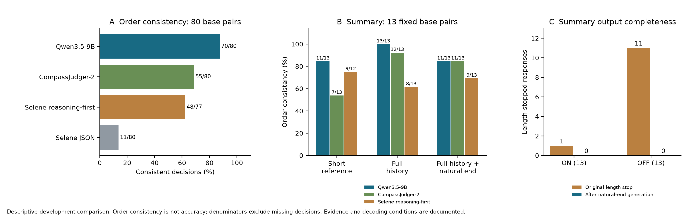

# 从回复偏好到资源实质收益：裁判测量分析

研究者于 2026-09-17 明确要求将这轮尝试作为研究问题或实验结果保留。本文将已经完成的开发实验组织成可供论文使用的探索性测量分析，保留数据、图表、方法与限制。它可置于 Paper-1 的标签构建／测量有效性部分，完整结果放附录；RQ1 的策略选择与 RQ2 的记忆选择仍是主体。

## 测量问题

**现成的 LLM 裁判能否区分“更偏好的回复”与“资源带来的任务实质收益”？这种判断如何受证据完整性、输出布局和生成完整性影响？**

PM 要学习的是注入某类资源后产生任务定义实质改善的概率。更流畅、更长、更温暖或更简洁只是可能相关的回复属性，不能自动成为正收益标签。裁判需要同时完成事实依据检查、任务完成度比较和实质性判断；这三个环节可能分别失败。

这项问题是根据开发结果形成的探索性问题，不把现有材料描述为为该问题事先预注册的独立确认样本。研究者允许查看、复用和修正材料；通过保留版本和明确实验条件实现可复查。

## 实验组织

| 分析 | 固定内容与改变内容 | 数据规模 | 能回答的问题 |
|---|---|---:|---|
| 三候选配置比较 | 同一四类标准、同一题面与回答；各模型使用合理固定配置 | 80 对 × 双顺序 × 3 配置 = 480 次 | 当前完整配置的稳定性、参照差异和具体错误 |
| Selene 输出布局适配 | 固定权重、greedy、证据与标准；JSON 改为先理由后结论 | 同一 80 对 × 双顺序 = 160 次 | 格式适配是否影响当前任务表现 |
| Summary 完整证据 | 固定旧回答；短摘要替换为完整严格过去历史，并增加证据使用说明 | 13 对 × 双顺序 × 3 配置 = 78 次 | 补齐事实依据后判断如何变化 |
| Summary 生成完整性 | 固定完整历史；改用自然结束回答 | 同一 13 对 × 双顺序 × 3 配置 = 78 次 | 消除旧截断后的判断变化 |
| Generator 停止方式 | 同一 26 个原请求、固定生成栈；取消任务级短输出上限 | 13 ON + 13 OFF | 旧触顶是否确实截断了后续内容 |

原始 A 是联合人评。六题复核、辅助事实敏感性和 AI B 分列；原始 A 的 80 对包括 56 对相当、12 对不确定、12 对明确胜负。总同判率会受到类别不平衡影响。反序题用于检查稳定性，不增加独立语义样本数。

## 可直接保留的发现

**一，稳定性、参照同判和实质性识别是不同维度。** Qwen 换序一致 70/80，高于 Compass 的 55/80 与 Selene JSON 的 11/80；但 Qwen 在 80 个基础呈现中给出 73 个明确胜负、7 个相当、0 个不确定。人工核查还发现它在两回答都未回答所问事实时，以轻微简洁性优势选出胜者。因此，换序稳定不能单独证明标签有效。原始 A 同判也不是独立真值准确率。

**二，输出布局是实际影响因素。** Selene 改为先理由后结论后，换序一致升至 48/77，另外 3 对缺失；原 JSON 版本有明显展示位置 A 倾向和理由／标签矛盾。不能只根据一次不适配的 JSON 运行概括该模型的裁判能力；也不能把这次改善外推到其他模型或所有提示。仍保留 JSON 原结果，适配结果明确标为开发后续。

**三，参考摘要不穷尽源历史。** 已核实的 `p5::summary::1` 案例中，ON 回答里的伴侣全职工作、本人较低压力的新岗位和父亲去世相关治疗均有原始历史支持。短参考省略了部分事实，Qwen 曾将其中真实内容判为幻觉。补齐历史后，胜者未变但决定性理由得到修正。这说明最终胜负正确也可能掩盖依据错误。

完整历史条件下，Qwen、Compass、Selene 的旧回答换序一致分别为 13/13、12/13、8/13；自然结束回答条件为 11/13、11/13、9/13。补齐证据改变基础判决分别为 3/13、6/13、4/12；补全回答进一步改变 0/13、1/13、3/13。改变不自动等于纠错，也不代表全部事实检查已经可靠。

**四，生成截断确实不对称，但消除截断不保证正确。** 原先 OFF 11/13 触顶、ON 1/13 触顶；取消短输出上限后 26/26 正常结束。12 条旧截断均为新回复的完整前缀，14 条旧正常回复逐字不变。某些延续仍编造日期、事件或复用了系统提示中的示例人物，部分 ON 仍拒答。应分别报告生成完整性和回答正确性。

## 官方指标与源事实的关系

固定版本的 ES-MemEval Summary scorer 同时计数参考／生成／召回事件，并依据参考摘要评价幻觉。源代码明确把“生成摘要有而参考摘要没有的事件”纳入幻觉描述。因此，官方分数主要反映该参考条件下的覆盖与一致性，不能直接等同于对全部原始历史的事实忠实度。[官方评分源码](https://github.com/slptongji/ES-MemEval/blob/692624208acc077b8867698c1d6fcd998dee641a/src/lib/sum/sum_experiment.py#L171)

Paper-1 继续报告原官方指标，保证与已有工作可比；本测量分析单独使用完整历史核查事实。当前证据说明这两种测量可能存在差别，**尚未实测 GPT‑4o 官方 scorer 在这些新对照上的差异**，不能提前断言官方分数已经误判了某一比例的样本，也不据此改写官方提示或参考答案。

## 可用于论文的结果段落草稿

> 在构建资源选择监督前，我们比较了三种本地裁判配置，并检查了展示顺序、输出布局、参考证据与生成完整性。结果显示，判决稳定性并不足以保证对任务实质改善的识别：换序最稳定的配置仍在部分题目上依据轻微表达差异区分胜负。将简短参考扩展为完整历史能够纠正部分事实依据错误，但未消除所有判断问题。与此同时，取消短生成上限消除了原有 ON/OFF 截断不对称，却未自动解决内容错误。由此，我们将裁判输出作为需结合任务证据解释的测量结果，并继续使用官方任务指标进行资源量校准与最终能力评价。

## 解释边界与后续用途

- 比较对象是模型与解码配置的组合；Qwen 的采样与双顺序 seed 不同，顺序不一致包含采样波动。
- 完整历史条件同时加入证据使用说明，不能把差异全部归因于上下文长度。
- 现有明确收益样本较少，尤其 ESC/DG；不能据此精确估计正收益识别能力。
- 旧人评对应旧题面，新证据／新回复条件不产生新的独立人评准确率。
- 同一原始材料的各诊断不能累加成几百个独立样本；定性案例用来说明机制，不用于估计错误发生率。

后续本地开发优先 Qwen，Compass 作补充；当前没有配置自动承担全任务 material-benefit 标签。下一阶段先执行官方质量驱动的资源量校准，保留 Summary/DG 的实质性限制。如果未来独立扩成裁判论文，应增加事先定义的实质差异类型与来源可核查案例，而不是只继续增加模型数量。这项扩展尚未启动。

数据入口：[完整运行报告](PM_PAPER1_LOCAL_TEACHER_DEVELOPMENT_RESULTS_20260917_ZH.md)、[CSV 表](reviews/20260917/judge_measurement_table.csv)、[PDF 图](reviews/20260917/judge_measurement_figure.pdf)、[SVG 图](reviews/20260917/judge_measurement_figure.svg)、[图表来源记录](reviews/20260917/judge_measurement_figure_manifest.json)。新分析不新增模型调用。
